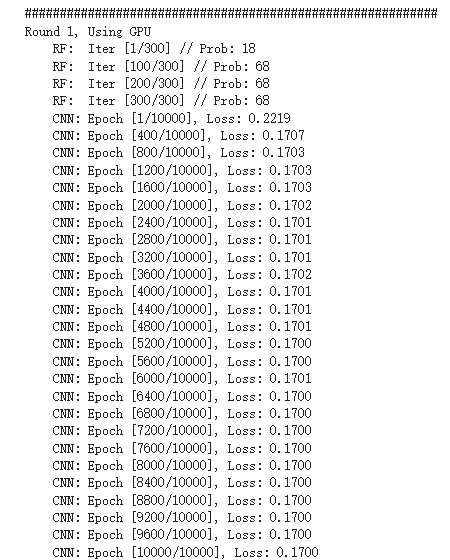
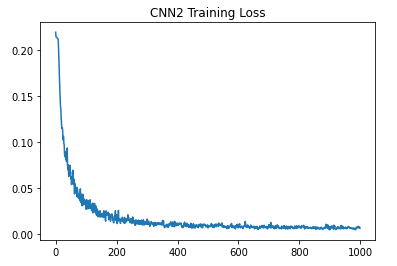

# Face-Alignment-DRF
# To be determined
* NME Loss 使用的 oculr distance 用预测点还是 ground truth.
* NME Loss 使用的 pupil distance 的眼睛中心点坐标如何计算。
* Test set 是否需要切割人脸。
* Train set 切割人脸采用 landmarks 坐标，导致很多点在切割之后的边缘，是否需要限制长宽比之类，修正切割框的位置。

# Weekly

| Time | Achievements |
|  :----:  | :----  |
| **4.30-5.02** | 考完试休息两天，补觉，倒回时差。 |
| **5.03-5.09** | 找房租房搬家，写大作业结课报告，补觉。|
| **5.10-5.16** | 读文献，看大家做 Face Alignment 用什么数据集、用什么指标评价、用什么方法。|
| **5.17-5.23** | 细读与我方法有关的文献。完成裁剪人脸、裁剪特征点、PCA，Procuses Analysis 代码。|
| **5.24-5.30** | 实现 Gaussian Regression Tree 方法 (Sequential)，得到初步结果。|
| **5.31-6.06** | 实现 Gaussian Regression Tree 方法 (Iterative)，结果误差很大且难收敛。搞清楚了数据集，全部下载到手。|
| **6.07-6.13** | 实现 Heatmap Regression，所有待检测点在一张图上。后发现无法 argmax，且无法确定特征点顺序。改为每个点一张 Heatmap，实现代码得到初步结果。拟合效果还是很差。|
| **6.14-6.20** | 将 Backbone 换成 Hourglass，由于 Pytorch 里没有现成的 Model，所以需要自己找代码自己 pretrain。将 Helen Dataset 封装上 Dataloader。重写 Phi 函数，将 Decision Tree 数量和深度定为全局变量。结论：效果依然不好。|
| **6.21-6.27** | 解决预测结果一致问题，通过增大 leaf node 数量以及提高 CNN 训练 Iterations. CNN Loss 与 Regression Tress loss 须一致。跑通 KL Loss 训练代码，测试超参数 Heatmap Variance， CNN Iterations 和 Leaf Node 数量对预测结果的影响。结论：Heatmap 变化不大，散落的点无法聚拢。|
| **6.28-7.04** | 解决训练时 Loss 上升问题，是函数误用，但参数更新方法是对的。太多需要调整的超参数，分别测试能否改进拟合精度，都失败。本周实验方向多，导致代码版本太多，非常耗费调试时间。意识到问题以后统一最新版代码。 |

# 日志

  <b> 5.26-5.30 </b > 

  
## 5.26 周三 (6.5h)
* 发现原始的 landmarks 坐标经过 Procuses 变换后丧失了缩放、旋转、位移的数值，导致跟图片无法对应。重新做数据处理，直接用 PCA, 然后归一化到 (0,1) 之间。保证与图片对应。
  
## 5.27 周四 (7.5h)
* 日志早就应该开始写了，把每天遇到的问题或者想法记录下来，比草稿纸更有效。算了，从今天开始也不晚。
* 增加 GPU 部分，CNN 可以在 CUDA 上跑了。
* 调通了训练部分代码，但 Loss 基本没动，CNN 输出很小，做 Loss 的时候基本是 Mean Face.
* 之前的 Flag, 五月底之前至少有个结果，达成。即便结果很烂，但模型框架有了。
  
## 5.28 周五 (7.5h)
* 多变量高斯求 pdf 的函数原来用的是 scipy 库，但它只能 cpu 运行，且不支持输入矩阵，所以只能用两层循环，很慢。有多变量高斯的库很多，但基本是从分布里抽取随机数，不支持输入向量返回概率值。找到 torch.distributions 里有替代品，现在整个模型都能在 GPU 上跑了。
* 应该在开头定义 device 全局变量，免得一个变量一个变量的搬运到 cpu 或者 cuda。
* 模型训不动的问题，我觉得可能是这样，数据点的分布可能是很稀疏的。用 8 个 20 维高斯来拟合这些点的分布，首先需要很好的初始化，不然初始化到没有散点的空间里就会导致概率为 0，报错 "不能为NaN"之类。如果初始化时候这八个高斯差别不大，又会导致他们趋于同一个分布，无法向八个方向发展，变成用一个 20 维高斯来拟合。尝试解决：先用 3-5 维高斯试试能不能不那么依赖初始化的数值。
* 另一个之前没考虑过的是，如果拟合 8 个 20 维高斯，需要多少数据点。恐怕需要大量数据。
* 将多变量高斯初始化时的 Mean 设为 Kmeans 聚类中心点。
* 发现 CNN 输出一直很小，尝试把数据缩减为 2 维，用 EM 算法使多元正太收敛。缩减为二维以后可以画散点图帮助 debug. 结果证明，即便是二维的情况也无法收敛。仔细检查 EM 算法，没有问题。发现乘以了系数 pi 导致点全部缩到原点。CNN 输出一直很小的原因查明，解决方案待定。
  
## 5.29 周六 (0h)
* 吃饭睡觉，休息的一天。点评上说“镇鼎鸡”是上海老字号了，白切鸡专卖。刚好附近有一家，遂去吃。白切鸡做法简单，取三黄鸡水煮即可，熟度至刚刚断生为最佳，鸡肉全靠蘸料提味。难点在于，鸡肉不能有腥味，如果原材料不新鲜或者放久了都不行。这家店价格还行，买四分之一只（鸡腿部），加一碗鸡汁葱油拌面，五十块。如果店面离我更近，应该会经常去。
* Gaussian 部分的 Inference 有问题, pi 的意义不对。

## 5.30 周日 (6h)
* 前几天一直遇到的问题是，CNN 的预测输出来是 Mean Shape, 今天得到解决。一个是 CNN 做 Loss 的方式不对，应该将 CNN 输出与这些每个样本放在 Multivariate-Gaussian 里面的得到的概率做 Loss，再一个是 CNN 训练不够，现在是 4000 Epoch 起（其实 2000 左右即可收敛，但具体多少跟 rf_dim 有关）。之前做 loss 用每个高斯的 Mean 乘以 CNN 输出（当作概率），一是输出没有归一化，导致很小，加上 Mean Shape 以后几乎被吞掉不计。二是没有发挥 Gaussian 的作用，训练出来的 Covariance 和 Pi 没有用上。
* 现在的问题是高斯维度没办法太高，太高会报错 Covariance 里有不合法值，导致预测误差很大。
* 跟老师聊了会天，可能思路要变，得换方法。
* 几篇文章要看，“Look at boundary""label distribution learning""Does Learning Specific Feature for Related Parts help" 以及想看的 Capsule Net 相关文章。
   

  <b> 5.31-6.06 </b > 

## 5.31 周一 (6.5h)
* 今天主要任务是看文献。
* 看"Age estimation", 深入公式，确实原来漏掉了一部分内容，但大差不差。怎么优化心里有数了，文章里边把连续随机变量的概率密度值乘以置信度得到另一个概率，但连续随机变量概率密度是不一定在 0-1 之间的，只是概率密度对随机变量的积分为 1. 离散随机变量的概率值才在 (0,1) 之间，所以这里需要归一化，但文章没写。这个点是文章里非常容易忽略，实践起来容易出错的东西，因为多元正太维度变高以后这个概率密度会变得巨大，以至于报错。另需要找找怎么对自定义损失函数用 Pytorch 自动求导。明天写代码，争取复现。
* 看"Learning Specific Feature", 跟预想的差不多，把互相联系的需要求的变量放在一组进行回归，模型可以少学一些不必要的变换，能提高精度。但他提到求解互信息的方法，以及如何将网络堆叠，是我没考虑到的。
* 看"Label Distributiob Learning", 标题说是预测分布，搞得我以为是得到一个函数，其实是为每个可能的 label 预测一个可能性罢了，叫 distribution. 做 Loss 的时候把 KL divergence 转化为 Cross entropy loss, Leaf Node 用 Variational Bounding, Split node 用 Back probagation. 没明白 label 由 one-hot 改为 distribution 有什么好处，可能不是这么改有好处，而是根据问题的实际意义，有的可以用 one-hot label, 有的需要用 distribution. 

## 6.01 周二 (7.5h)
* 按照昨天看 "Age detection" 的方法改代码，又出现所有图片的 probs 全一样的情况。很迷。输出完全没有因图而异，从理论分析我感觉是 loss 有问题。
* 代码着实码不出来，报错 Covariance matrix 有非法值，其实就是有的 Covariance Matrix 里的值小于 1e-6，导致被判定 sigma 为 Singular matrix...难道要开始推公式了吗...应该是更新参数的问题。
* Regression tree 的 train 部分检查过了，应该没问题了。解决所有图片输出一致的问题，尝试在第一轮训练让 cnn output 拟合各自图片在 gaussian 里的概率，在第一步训练用 L1 loss 让 cnn 输出各异，后续正常用 cross entropy loss。失败。每张图片输出还是一样，无法各自拟合标签。
* 解决每张图片输出相同的问题，与其说是解决，不如说是问题自己消失了。尝试增大 CNN 训练的 epoch，没用。改变 learning rate，没用。将 loss function 换成手写的，在数学上等价的函数，没用。怀疑使用了 in-place operation 导致 pytorch 建图错误，反复检测，没用。后来某次重启机器，顺利收敛。

## 6.02 周三 (7.5h)
* 奇了，昨天代码都没动，只是今天开机重新跑一遍，结果又出现 CNN 输出一样数据的问题。
* 除此之外还报错 Covariance 有 invalid value。尝试先用 svd，强行把过小的 singular value 改为 1e-5 以躲过正确性检查，但这样训下来有的 Covariance 居然变成 0 了。无计可施。
* invalid value 以强行打补丁的形式解决。还剩 CNN 输出一致的问题。
* 小了，格局小了。之前 Sequential Training 的时候，CNN 训练 400 epoch，不收敛，后来加到 2000 epoch, 发现在 500-800 epoch 的时候，loss 会迅速下降。即，loss 会先从 0.5 降到 0.2, 大概花几十个 epoch，然后一直维持在 loss=0.2 不动。训练到 500-800 epoch, loss 突然开始下降，很快收敛到 0 附近。所以在 Iterative training，直接给 epoch 设为 2000，结果是没有办法收敛。这是前言。训 Iterative Training 训不动，转头去看之前可以收敛的 Sequential Training，其实这段代码偶尔也不能收敛，所以一定有没有查明的问题。有一次训 Sequentian Training 的 CNN，发现中间的 loss 维持在平台期达到 1300 epoch，收到启发，在 Iterative Training 把 epoch 加到 1w，可惜还是不能收敛，几乎排除 epoch 不够大的原因。
* 左图：Sequential Training, 右图：Iterative Training.

## 6.03 周四 (4h)
* 重新跑了昨天的代码，问题依旧。整理本周进展，做 PPT，备明日汇报。

## 6.04 周五 (4.5h)
* 昨夜失眠，三点才睡着。幸好不是社畜，不用明天八点上班。睡不着的原因应该是最近减肥，摄入不抵消耗，躺在床上很饿。晚饭在食堂吃了一碗云吞加一只鸭腿，又点了一份炒饭，已经吃这么多了，没想到晚上还是饿，三点爬起来摸出一袋饼干吃了，方才睡去。为什么要这么痛苦的节食减肥呢，瘦下来以后也不是到了终点，可以敞开吃喝。人生还得过，难道想保持身材就要一直节食吗，成本也太高了。
* CNN 输出一致的问题，我打算减小 learning rate 再试试，组会提出这个问题，被建议更换 optimizer, 之前用 Adam，那换成 SGDM 试试。实验结果：两个方法都没用。Loss 的平台现象仍然存在。

## 6.05 周六 (0.5h)
* 补觉。睡了13小时。

## 6.06 周日 (2h)
* 看书三分之一本，照此进度有望本月看完。
  

  <b> 6.07-6.13 </b > 

  
## 6.07 周一 (8h)
* 收敛了，代码完全没改过。来实验室第一件事，把上次的代码跑一遍看看。周末没想到还有什么可能的原因导致 CNN 输出一致，就给自己放了两天假，结果今天问题消失了。Adam 优化器，lr: 3e-4，其实这组参数上周五试过，不行，但今天就有了。神奇。把结果保存下来。本来已经做好了搞体力活的准备，挨个检查输出是不是跟手算的一样，检查梯度啥的，看来不用了。但稳定性为什么会是个问题，原因尚不明确，代码不能复现也不行啊。

* 学到一个小知识，arXiv 读 archive.
* 发现 test label 切的不齐，数据处理的代码需要修改。
* 又跑了几遍代码，都能收敛。但总的来说模型学不到太多变化，打算采用分而治之的方式，选取有联系的点单独学习，而不是胡子眉毛一把抓。
* 换 Heatmap Regression 解决人脸对齐，完成：由 landmarks 坐标生成热图，训练 regression tree，训练 CNN 的代码。代码里的问题还有很多，明天仔细调整。

## 6.08 周二 (6.5h)
* 改完 Heatmap Regression 训练部分代码，现在能输出比较像样的热图。下一步，从热图找到特征点坐标。直接 topk() 存在全局最大无法代表局部最大的问题，如果用动态阈值扫描，还需要考虑两个点相距很近的情况。
* 想到，即便找出特征点坐标，也没法排序。不排序就不知道哪个点是眼角，无法计算 NME Loss。这才明白，为什么人家都是每个特征点做一个 Heatmap. 既能减小预测误差，又能知道顺序。

## 6.09 周三 (9h)
* 把 Heatmap 由所有点一张图改为每个点一张图，写代码。这样还有个好处，就是如果后面需要把相关性强的点分组回归，自然需要一个点一张 Heatmap.
* 改为一个点一张 Heatmap 以后计算量陡增，难以收敛。且学习 Distribution 似乎失去了意义，因为只有一张图只有一个目标点，变成 one-hot label.
* 观察到不同 Leaf node 差别不大，cnn 输出也在 0.5 附近，可知基本无筛选，算法并未收敛。重新研究如何优化 leaf node，采用 pinv 还是 step by step. 

## 6.10 周四 (7.5h)
* 今天是 Math Day. 1) KL Divergence & Entropy & Cross Entropy; 2) Linear Least Square & Pseudo Inverse; 3) Jensen's Inequality; 4) Convex Optimization & Lagrangian & Duality.

## 6.11 周五 (5h)
* 组会，提出几个新思路，后续改进。1）backbone 用 pretrain 人脸检测 model。2）backbone 用 Hourglass。 3）CNN FC 直接出 Heatmap 看看能否收敛。

## 6.12 周六 (0h)
* 补觉

## 6.13 周日 (0h)
* 补觉

  <b> 6.14-6.20 </b > 

  
## 6.14 周一 (2h)
* 看文献 Hourglass. 
* 欢度端午，跟同学进城吃饭压马路。

## 6.15 周二 (7.5h)
* 看 Hourglass 文献和代码。
* 重新裁剪图片，大小由 224\*224 改为 256\*256，顺带修正 test label 越界问题。 

## 6.16 周三 (7.5h)
* 完成 DataLoader 加载数据。测试的时候老是“因为占满所有可用 RAM ”崩溃，后修改完善，避免定义过大的数组，且将重复不变的部分放在 init() 函数里，节约时间。
* 将 Backbone 更换为 Hourglass，测试直接拟合 Heatmap。实验结果：可以收敛。

## 6.17 周四 (8.5h) 
* 将 Hourglass Backbone 和 Regression Tree 拼在一起， Iterative Training. 代码跑通。
* 发现 testset 图片裁剪不对，重新整理数据集。
* 训练时总报错 cuda memory 不足，发现是 fc 层过大，重新调整网络结构。又发现，之前因为要得到概率，网络输出须为正，遂以 Relu 结尾，结果杀掉了一半神经元，于是修改为绝对值。
* 效果还是很烂，leaf node 里 heatmap 分散，且 Hourglass 训练时 Loss 不动。

## 6.18 周五 (9h) 
* 组会，发现对 phi 的函数理解错误，从 cnn_fc 到 probability 的映射关系错了。
* 修改以后重新跑，leaf node 依然相似。被建议加大 decision tree 深度，以及增加 tree 的数量。打算把深度和数量设为可调整的变量，这样代码要改好多部分。
* 改完代码，将 decision tree 深度，以及 tree 的数量作为全局变量，效果有提升，leaf node 之间开始显现差异，但效果依然不好，且 CNN loss 基本不动。考虑用 Mask 抛开 CNN loss 时 Heatmap 里值很小的部分，这些点不会被选为 landmarks 但数量众多，影响训练。

## 6.19 周六 (0h) 
* 补觉，很困。睡了11.5 h

## 6.20 周日 (0h) 
* 会友。

  <b> 6.21-6.27 </b > 

  
## 6.21 周一 (0h)
* 办事。不仅一天都奔波在路上，还起的鬼早，在地铁上站一路没座位。
* 工作日开门，在我应该上班的时候他们才上班。耽误一个周一，进度又落下了。周六不休息了，在实验室写代码吧。

## 6.22 周二 (7.5h)
* 明天 Paper Reading 该我讲，本打算上周末看 CapsNet，但周末休息去了，于是今天看文章，做 PPT.

## 6.23 周三 (8h)
* 增加 Mask 以规范 CNN 训练过程，loss 的数值有变小，但还是基本没动，在小数点后六位上略有升高。怀疑是 CNN 未完全训练。调大学习率，从 0.001 至 0.01, SGD, loss 开始下降了。增大训练轮次，发现在 70-100 iterations 的时候 loss 会有相对幅度较大的下降。之前受限于训练时间，CNN 设定为 50 轮。按照现在的设定，跑完一次需要 4 小时。
* Leaf Node 优化方法可能存在问题。

## 6.24 周四 (7h)
* 发现 Label Distribution Learning 里优化 Leaf Node 的 Bounding 的方法，代码写错了。修改以后可以收敛。
* CNN Loss 与 Decision Tree Loss 还有 Leaf Node 优化方法需要搭配。L2 的话 Leaf Node 是 Pinv, KL Loss 的时候 Leaf Node 用 Bounding 优化。
* Leaf Node 的 HeatMap 太分散，导致乘上 probability 以后没有聚在一起。考虑强行变成单峰，但这样人工干预太多了。或者考虑把 Leaf Node 都变成单点， Decision Tree 在里边选，看哪个点是 Label，但这样有相当于在 CNN 最后一层就确定了 Landmarks 坐标，Decision Tree 失去意义。
* 考虑将 xy 分开学习，每个坐标用一个 Label Distribution 或者 Gaussian 拟合。再取 argmax 分别得到 x,y 坐标。

## 6.25 周五 (7.5h)
* 采用 KL Divergence Loss 的 Iterative Training 的结果出来了，每个 Leaf Node 存的 Heatmap 都是单峰，有一到两个两点，其它值很小。乘以 Probability 以后是若干分散的点，没有聚在一起。原因可能是，GT Heatmap 的 variance 太小，打算调大 variance 试一试。
* 代码太费时间，跑一遍花 3-4 小时，验证想法需要花挺久。
* 跑了 Variance = 5, 效果没太大不同。

## 6.26 周六 (0.5h)
* 一天在街上，累。
* 跑了 Variance = 3, 增大 CNN Iterations = 1000, 效果没太大不同。

## 6.27 周日 (0h)
* 补觉，恢复精神。了解一桩大事。
* 跑了 Variance = 3, 增大 dim_tree = 6, Leaf Node 数量多了，效果没太大不同。

  <b> 6.28-7.04 </b > 

## 6.28 周一 (0h)
* 朋友到访，畅聊一天。

## 6.29 周二 (7.5h)
* 现在主要问题有两个，一个是更新 Regression Trees 时，loss 会上升。另一个是，以更新一次 CNN 和 Regression Tree 作为一组 Round，每组 Round 之间 Loss 是上升的。
* 看了之前训练的中间结果，前一两次和后面训练完，结果没什么变化。以及调整 Heatmap Variance 影响不大，prediction 依然无法聚集，只是 variance 变大，prediction 会模糊一些。
* 已经六月底了，项目进度堪忧。
* 完善代码：保存每个 Round 的图片，将函数打包放在 utils 里，代码更规范。

## 6.30 周三 (8h)
* 更改 RF 更新模式，Sequential 或者 Avg，跑了一轮，没什么影响。avg 要更糊一些。两个效果都不好。
* 想到，可能 KL Divergence 约束力不够，它只能让两个分布的形状相似，但没有办法约束两个分布的最大值位置相同，也就是经过 argmax 以后的结果无法保证。可能这就是 Heatmap KL divergence 越训练越小，但坐标的 L1 Loss 越训练越大的原因。可能更小的 KL Divergence 是通过拉平 Heatmap 达到，所以经过 argmax 算出来的坐标越来越不准，图片也糊。
* 看文献 "e2e learning of decision trees"，借鉴其退火算法，改好代码，明天跑出结果。
* 现在跑一遍代码花费 15h, 颇慢。

## 7.01 周四 (6h)
* CNN 训练的时候 probability 不变成 one hot, 这个很明确。但 RF 训练的时候，CNN probability 不应该变成 one hot。昨天代码写错了，白跑一晚上。但也没白跑吧，coordinate loss 的数值是最近几周最小的，而且随着训练在下降，不容易。
* 代码版本太多了，因为这周改了太多参数，搞得我有点混乱，得统一一个最新版，以后都在这个基础上改。
* 得导师指导，1）数据太小，200 张图片，48 个 leaf node，参数太多，训不出来，得多用点图片。2）退火的参数可适当调整，不必按照文献里的，范围限定在 1-3, 可以试试更大的范围。3）CNN loss 太小，可能导致反向传播梯度很小，可以考虑提高学习率（但我觉得，目前的学习率下面，CNN 输出的 probability，对同一个样本，最大和最小 prob 能有一倍的差距，我认为 CNN 输出是有区分度的，学习率应该足够）。

## 7.02 周五 (3h)
* 每轮 CNN 训完，训 Regression Tree 的时候，KL Loss 是上升的。这一段代码我单独拿出来测试过，可以收敛，不知道为什么放在网络里就不行，这个问题需要解决。
* 看 torch.nn.KLDivLoss() 具体是怎么计算的，有没有在整个图片上平均，导致 loss 很小。
* 经过检查，KL loss 在 regression tree 训练过程中上升，但 L1 loss 在训练过程中是下降的，且对比 loss 变化曲线，RF_Iters 超参数，即 regression tree 每个 leaf node 更新轮次，取值为 60 合理。
* 破案了，torch.nn.KLDivLoss(target,label) = torch.sum(label * (torch.log(label)-target))/n_elements, n_elements 是 target 所有元素的个数。所以是在整个 Heatmap 上平均了。
* 发现把 torch.nn.KLDivLoss(target,label) 改为 torch.nn.KLDivLoss(label,target), 那么 regression tree 训练的时候，loss 就下降了。但之前的代码也没白跑，只是 loss 的计算方式罢了，更新 leaf node 的函数没有错。

## 7.03 周六 (0h)
* Colab GPU 使用过多，最近暂时不能用。
* 聊天，别人的工作状态，生活态度，比我强太多。

## 7.04 周日 (1h)
* 重温《利刃出鞘》。做了之前堆积已久的杂事。

## 7.05 周一 (5.5h)
* 看 “Extreme points”, 企图解决 Heatmap 里多个特征点如何提取的问题。但是人家文章里不是解决这个问题的。
* 完善代码，今天不知何故，非常疲惫。
* 在 200 张图的小数据集上实现 overfit，里程碑式胜利。吃宵夜以庆祝。

## 7.06 周二 (xh)
* 之前在小数据集上，训练误差小，测试误差大。在 2000 张图的大数据集上重跑代码。
* 从 Loss 数值来看，确实可以实现收敛。
* 尝试使用全部特征点训练，而不只是眼部。

  <b> 7.12-7.18 </b > 

## 7.12 周一 (xh)

## 7.18 周二 (xh)

